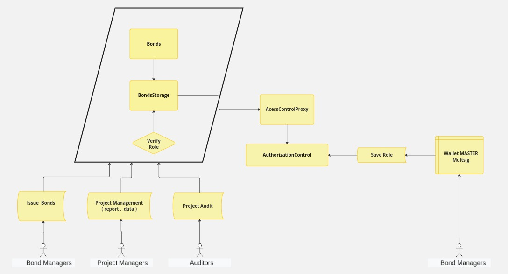
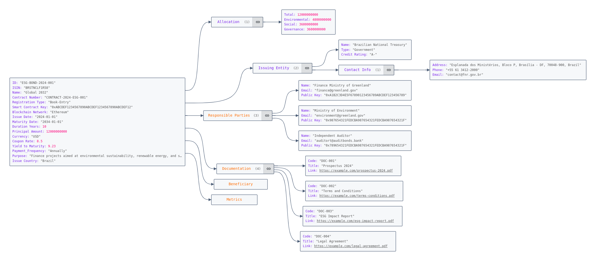

# Clara ESG: Tokenized Green Bonds with Built-in Impact Ratings

## Architecture

# 

This diagram  represents the architecture of a **Decentralized architecture** for managing bonds and project data, focusing on data collection, validation, immutability, and transparency. It illustrates the different layers and their interactions in this decentralized system.

---

### **Flow of Data and Interactions**

1. **Project Data Submission:**  
   Data from project management systems, IoT devices, and external APIs are transmitted to the validation nodes through the communication gateways.
   
2. **Data Validation:**  
   The validation nodes verify the authenticity of the data before it is passed to the smart contracts for recording and rating calculations.
   
3. **Data Storage and Hashing:**  
   Once validated, the data is stored on the blockchain and decentralized storage (IPFS/Filecoin). Hashes are generated to ensure data integrity.
   
4. **User and Auditor Interaction:**  
   Bond managers can monitor the project performance in real time via the dashboard, while external auditors can access data through public APIs to ensure transparency.

5. **Security and Evidence Validation:**  
   Digital signatures, encryption, and immutable audit trails ensure that all data is securely stored, and geographical evidence is submitted to validate project authenticity.

#### **1. Data Collector Layer**
This layer focuses on gathering data from various systems and devices.
- **A1: Project Management Systems ERP/CRM** – These systems manage and send project data to the decentralized network.
- **A2: IoT Devices** – Collect real-time data (e.g., environmental data or geographical indicators) from physical assets or project locations.
- **A3: APIs for Data Integration** – Used to pull external data sources, such as weather reports or financial indicators, and integrate them into the system.

The data collected from these sources is transmitted to the **Decentralized Network** for validation.

---

#### **2. Decentralized Network Layer**
This layer ensures secure communication and validation of data.
- **B1: Validation Nodes** – Nodes in the decentralized network that validate incoming data to ensure it has not been tampered with.
- **B2: Communication Gateways** – Securely transmit data from the collectors to the validation nodes.

The validated data is sent to the **Blockchain and Smart Contracts Layer** for recording and further processing.

---

#### **3. Blockchain and Smart Contracts Layer**
The core layer of the system, where all critical operations happen on the blockchain.
- **C1: Blockchain (Public/Permissioned)** – Stores all the validated data in an immutable manner, ensuring transparency and security.
- **C2: Smart Contracts for Bond Issuance, Data Locking, and Penalty Enforcement** – Enforces business rules such as bond issuance, preventing unauthorized modifications to stored data, and handling penalties for non-compliance.
- **C3: Smart Contracts for Rating Calculation** – Automatically calculates the bond rating based on weighted project ratings, enforcing transparency in financial operations.

Data is sent to the **Decentralized Storage Layer** for secure storage.

---

#### **4. Decentralized Storage Layer**
Ensures the safe and immutable storage of all collected and validated data.
- **D1: IPFS/Filecoin for Decentralized Storage** – Stores large files and project reports in a decentralized way, making them accessible to anyone while ensuring they cannot be modified.
- **D2: Data Hashing for Integrity** – Generates cryptographic hashes to verify the integrity of data, ensuring that no tampering has occurred.

The stored data is exposed to users and external auditors for transparency.

---

#### **5. Application and User Interface Layer**
Provides interfaces for interacting with the system and ensuring transparency for both internal and external stakeholders.
- **F1: Monitoring Dashboard** – Allows bond managers to monitor project performance and real-time data related to bonds and project health.
- **F2: Report Submission Interface** – Enables project administrators to submit reports and evidence regarding project progress.
- **F3: Public Audit APIs** – Allow external auditors to access and audit the blockchain data to ensure compliance and transparency.

---

#### **6. Security and Audit Layer**
Ensures the integrity and security of the system through cryptographic methods.
- **G1: Digital Signatures and Encryption** – Ensures that all data is authenticated and secure.
- **G2: Immutable Audit Trail** – Maintains a permanent, immutable record of all actions and data submissions on the blockchain, making it impossible to alter historical records.
- **G3: Geographical Evidence Submission** – Ensures that all project reports include geographical evidence to further validate data authenticity.

---

## **Security and Interoperability**

The implemented security architecture aims to promote interoperability by providing specific information for the securities, tailored to the needs of each agent participating in the process. This approach ensures that only authorized agents have the ability to modify the data defined in the metadata associated with each type of security.

**Customization and Metadata Control in Securities**

The ability to customize the securities according to their specific characteristics is provided through metadata. Simultaneously, we have implemented a strict control model, where only authorized agents are allowed to insert or update information in the securities, as defined by the "role" associated with the account in the security control (AuthorizationControl). This approach ensures that only properly authorized parties can update the information of the securities, ensuring the integrity and security of the security registry.

**Access Control**

Access to and manipulation of "roles" or functions is restricted to an exclusive MASTER user. Only this MASTER user has the privilege of adding accounts with access to these specific functions. It is worth noting that the MASTER account is configured as a multi-signer account, with the flexibility of being managed by a Hardware Security Module (HSM).

This structure provides a robust level of control and security, ensuring that only duly authorized users can influence the key configurations and operations related to the securities, while the MASTER account, managed by HSM, adds an extra layer of protection to the system's integrity.

**Security Architecture**

The security architecture is designed in a centralized manner, shared across various smart contracts, eliminating the need for updates in all contracts related to security roles. This approach optimizes the efficiency and maintenance of the system, ensuring that security policies and controls are applied uniformly and consistently throughout the network of contracts. By centralizing security management in a shared structure, we reduce operational complexity and promote a more cohesive and easy-to-maintain implementation.

**Hardware Security Module (HSM)**

A Hardware Security Module (HSM) is a dedicated physical device designed to protect and manage cryptographic keys, as well as perform cryptographic operations. With features such as high tamper-resistance and robust performance, HSMs are ideal for safeguarding sensitive data and facilitating digital transactions.

Widely used in sectors that handle substantial volumes of sensitive information, such as banking, finance, and healthcare, HSMs offer several benefits:

* **Enhanced Security:** They provide the highest level of security for data and cryptographic keys, being less susceptible to malware attacks or operating system vulnerabilities.

* **Regulatory Compliance:** They help organizations comply with data security regulations, such as PCI DSS and HIPAA.

* **Reduced Risk of Data Breaches:** They significantly reduce the risk of data breaches and cyberattacks.

## Information Architecture and Data Modeling

This document provides a detailed overview of the attributes contained within the  structure for the bond document. The bond represents a significant financial instrument
aimed at financing projects that promote environmental sustainability, social equity, and  governance excellence.

[Information Architecture and Data Modeling](docs/Information Architecture - Data Model of a Government Bond.md)