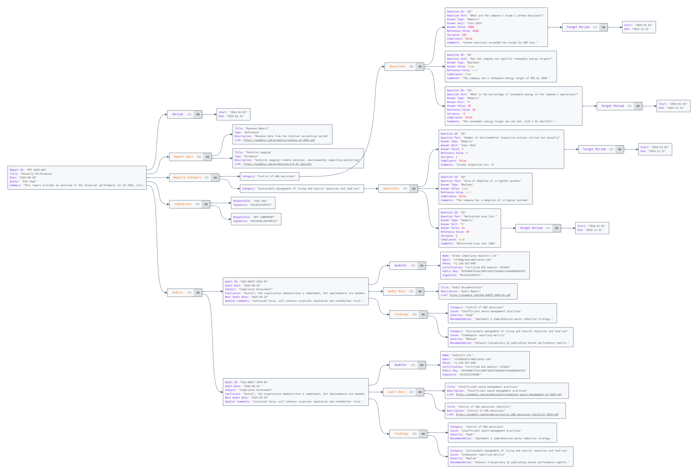

## Bond Data Model: Information Architecture and Data Modeling

This document provides a detailed overview of the attributes contained within the structure for the bond document. The bond represents a significant financial instrument aimed at financing projects that promote environmental sustainability, social equity, and governance excellence. 

Each attribute serves a specific purpose, contributing to a comprehensive understanding of the bond's characteristics, issuer details, financial metrics, and intended allocation of proceeds. This structured approach not only facilitates transparency but also aids stakeholders, including investors, regulators, and analysts, in evaluating the bond's impact and compliance with relevant standards.

By examining these attributes, stakeholders can appreciate the bond's strategic alignment with environmental, social, and governance (ESG) objectives while also gaining insights into the financial and operational frameworks governing its issuance. This clarity ensures informed decision-making and fosters confidence in the integrity and value of the bond offering. 

### **Bond : Attributes Description:**


- **ID**: 
  
  - **Description**: A unique identifier for the bond, allowing easy reference and retrieval.
  - **Example**: `"ESG-BOND-2024-001"`
  
- **ISIN**: 
  - **Description**: International Securities Identification Number; a unique code that identifies the bond globally.
  - **Example**: `"BRSTNCLF1R58"`

- **Name**: 
  - **Description**: The official name of the bond, often indicating its purpose or issuer.
  - **Example**: `"Global 2032"`

- **Contract Number**: 
  
  - **Description**: The specific contract number associated with the bond issuance.
  - **Example**: `"CONTRACT-2024-ESG-001"`
  
- **Registration Type**: 
  - **Description**: The method of registration for the bond, indicating how ownership is recorded (e.g., physical or electronic).
  - **Example**: `"Book-Entry"`

- **Smart Contract Key**: 
  - **Description**: A cryptographic key associated with the bond's smart contract on the blockchain.
  - **Example**: `"0xABCDEF1234567890ABCDEF1234567890ABCDEF12"`

- **Blockchain Network**: 
  - **Description**: The blockchain on which the bond's smart contract is deployed.
  - **Example**: `"Ethereum"`

- **Issue Date**: 
  - **Description**: The date when the bond is issued to investors.
  - **Example**: `"2024-01-01"`

- **Maturity Date**: 
  - **Description**: The date when the bond matures and the principal amount is repaid to investors.
  - **Example**: `"2034-01-01"`

- **Duration Years**: 
  - **Description**: The total duration (in years) from the issue date to the maturity date.
  - **Example**: `10`

- **Principal Amount**: 
  - **Description**: The total amount of money that the bond represents or the amount borrowed by the issuer.
  - **Example**: `12000000000`

- **Currency**: 
  - **Description**: The currency in which the bond's principal amount and coupon payments are denominated.
  - **Example**: `"USD"`

- **Coupon Rate**: 
  - **Description**: The interest rate that the issuer pays to bondholders, expressed as a percentage of the principal amount.
  - **Example**: `8.5`

- **Yield to Maturity**: 
  - **Description**: The total return anticipated on the bond if held until it matures, expressed as an annual rate.
  - **Example**: `9.23`

- **Payment Frequency**: 
  - **Description**: The frequency with which coupon payments are made to bondholders (e.g., annually, semi-annually).
  - **Example**: `"Annually"`

- **Allocation**: 
  - **Description**: A breakdown of how the bond proceeds will be allocated across different purposes, such as environmental or social projects.
  - **Sub-attributes**:
    - **Total**: Total amount allocated.
    - **Environmental**: Amount allocated to environmental projects.
    - **Social**: Amount allocated to social projects.
    - **Governance**: Amount allocated to governance projects.
  - **Example**:
    ```json
    "Allocation": {
      "Total": 12000000000,
      "Environmental": 4800000000,
      "Social": 3600000000,
      "Governance": 3600000000
    }
    ```

- **Purpose**: 
  - **Description**: The specific goals or projects that the bond proceeds are intended to finance.
  - **Example**: `"Finance projects aimed at environmental sustainability, renewable energy, and social equity."`

- **Issue Country**: 
  - **Description**: The country where the bond is issued.
  - **Example**: `"Brazil"`

- **Issuing Entity**: 
  - **Description**: Information about the entity that issues the bond.
  - **Sub-attributes**:
    - **Name**: The name of the issuer.
    - **Type**: The type of issuer (e.g., government, corporation).
    - **Credit Rating**: The credit rating of the issuer, indicating its creditworthiness.
    - **Contact Info**: Contact details for the issuing entity.
  - **Example**:
    ```json
    "Issuing Entity": {
      "Name": "Brazilian National Treasury",
      "Type": "Government",
      "Credit Rating": "A-",
      "Contact Info": {
        "Address": "Esplanada dos Ministérios, Bloco P, Brasília - DF, 70048-900, Brazil",
        "Phone": "+55 61 3412-2000",
        "Email": "contact@fnr.gov.br"
      }
    }
    ```

- **Responsible Parties**: 
  - **Description**: A list of parties responsible for the management and oversight of the bond.
  - **Sub-attributes**:
    - **Name**: The name of the responsible party.
    - **Email**: Contact email of the responsible party.
    - **Public Key**: A cryptographic public key associated with the party for secure communications.
  - **Example**:
    ```json
    "Responsible Parties": [
      {
        "Name": "Finance Ministry of Greenland",
        "Email": "finance@greenland.gov",
        "Public Key": "0xA1B2C3D4E5F67890123456789ABCDEF123456789"
      },
      {
        "Name": "Ministry of Environment",
        "Email": "environment@greenland.gov",
        "Public Key": "0x987654321FEDCBA987654321FEDCBA987654321F"
      },
      {
        "Name": "Independent Auditor",
        "Email": "auditort@auditbonds.bank",
        "Public Key": "0x789654321FEDCBA987654321FEDCBA987654321F"
      }
    ]
    ```

- **Documentation**: 
  - **Description**: A list of documents related to the bond, including their titles and links for access.
  - **Sub-attributes**:
    - **Code**: A unique code for the document.
    - **Title**: The title of the document.
    - **Link**: A URL link to the document.
  - **Example**:
    ```json
    "Documentation": [
      {
        "Code": "DOC-001",
        "Title": "Prospectus 2024",
        "Link": "https://example.com/prospectus-2024.pdf"
      },
      {
        "Code": "DOC-002",
        "Title": "Terms and Conditions",
        "Link": "https://example.com/terms-conditions.pdf"
      },
      {
        "Code": "DOC-003",
        "Title": "ESG Impact Report",
        "Link": "https://example.com/esg-impact-report.pdf"
      },
      {
        "Code": "DOC-004",
        "Title": "Legal Agreement",
        "Link": "https://example.com/legal-agreement.pdf"
      }
    ]
    ```

- **Metrics**: 
  - **Description**:  An array containing various groups of metrics related to the bond's performance and ESG objectives.

- **Projects**: 
  
  - **Description**: A list of projects who will benefit from the projects financed by the bond. 

### **Metrics Attributes Description:**

  #### **Group Type Attributes**:

  Each group in the metrics array contains the following attributes:

  - **Group Type**:
    - **Description**: The category of metrics, such as Financial or ESG, indicating the type of data represented.
    - **Example**: `"Financial"` or `"ESG"`

  - **Metrics**:
    - **Description**: An array containing individual metrics associated with the group type. Each metric includes the following attributes:

      #### **Metric Attributes**:

      - **Code**:
        - **Description**: A unique identifier for the metric, facilitating easy reference.
        - **Example**: `"FXO"` or `"C"`

      - **Metric**:
        - **Description**: The name of the metric being measured.
        - **Example**: `"XPTO"` or `"Carbon"`

      - **Value**:
        - **Description**: The numerical value associated with the metric.
        - **Example**: `12` or `10`

      - **Unit**:
        - **Description**: The unit of measurement for the value (e.g., tons, units).
        - **Example**: `"und"` or `"TON"`

      - **Frequency** (optional):
        - **Description**: The frequency at which the metric is reported (e.g., monthly, quarterly).
        - **Example**: `"monthly"`

      - **Definition** (optional):
        - **Description**: A detailed explanation of what the metric measures and its relevance.
        - **Example**: `"Ensure proper allocation of funds to projects aligning with ESG goals."`

      - **Reports Ref.**:
        - **Description**: An array of references to reports that provide more information or validation for the metric.
        - **Example**:
        ```json
        [
          "RPT-PROJ-AB-2024-001",
          "RPT-PROJ-XP-2024-001",
          "RPT-PROJ-AB-2024-002",
          "RPT-PROJ-XP-2024-002"
        ]
        ```

      - **History**:
        - **Description**: An array that provides historical data for the metric over defined periods. Each history entry includes the following attributes:

        #### **History Attributes**:

        - **Order**:
          - **Description**: The sequence number indicating the order of the data point in the history.
          - **Example**: `1` or `2`

        - **Period**:
          - **Description**: An object defining the time period for the recorded metric value. Contains:
            - **Start**: The start date of the reporting period.
            - **End**: The end date of the reporting period.
          - **Example**:
          ```json
          "Period": {
            "Start": "2024-01-01",
            "End": "2024-01-31"
          }
          ```

        - **Value**:
          - **Description**: The recorded value for the metric during the specified period.
          - **Example**: `10` or `12`

        - **Reports Ref.**:
          - **Description**: An array of references to reports that document the metric’s historical data.
          - **Example**:
          ```json
          [
            "RPT-PROJ-AB-2024-001",
            "RPT-PROJ-XP-2024-001"
          ]
          ```

### **Example JSON Structure for Bond Metrics:**
```json
{
  "ID": "ESG-BOND-2024-001",
  "ISIN": "BRSTNCLF1R58",
  "Name": "Global 2032",
  "Metrics": [
    {
      "Group Type": "Financial",
      "Metrics": [
        {
          "Code": "FXO",
          "Metric": "XPTO",
          "Value": 12,
          "Unit": "und",
          "Frequency": "monthly",
          "Definition": "Ensure proper allocation of funds to projects aligning with ESG goals.",
          "Reports Ref.": [
            "RPT-PROJ-AB-2024-001",
            "RPT-PROJ-XP-2024-001",
            "RPT-PROJ-AB-2024-002",
            "RPT-PROJ-XP-2024-002"
          ],
          "History": [
            {
              "Order": 1,
              "Period": {
                "Start": "2024-01-01",
                "End": "2024-01-31"
              },
              "Value": 10,
              "Reports Ref.": [
                "RPT-PROJ-AB-2024-001",
                "RPT-PROJ-XP-2024-001"
              ]
            },
            {
              "Order": 2,
              "Period": {
                "Start": "2024-02-01",
                "End": "2024-02-31"
              },
              "Value": 12,
              "Reports Ref.": [
                "RPT-PROJ-AB-2024-002",
                "RPT-PROJ-XP-2024-002"
              ]
            }
          ]
        }
      ]
    },
    {
      "Group Type": "ESG",
      "Metrics": [
        {
          "Code": "C",
          "Metric": "Carbon",
          "Value": 12,
          "Unit": "TON"
        },
        {
          "Code": "EXO",
          "Metric": "XPTO",
          "Value": 12,
          "Unit": "und",
          "Frequency": "monthly",
          "Definition": "Ensure proper allocation of funds to projects aligning with ESG goals.",
          "Reports Ref.": [
            "RPT-PROJ-AB-2024-001",
            "RPT-PROJ-XP-2024-001",
            "RPT-PROJ-AB-2024-002",
            "RPT-PROJ-XP-2024-002"
          ],
          "History": [
            {
              "Order": 1,
              "Period": {
                "Start": "2024-01-01",
                "End": "2024-01-31"
              },
              "Value": 10,
              "Reports Ref.": [
                "RPT-PROJ-AB-2024-001",
                "RPT-PROJ-XP-2024-001"
              ]
            },
            {
              "Order": 2,
              "Period": {
                "Start": "2024-02-01",
                "End": "2024-02-31"
              },
              "Value": 12,
              "Reports Ref.": [
                "RPT-PROJ-AB-2024-002",
                "RPT-PROJ-XP-2024-002"
              ]
            }
          ]
        }
      ]
    }
  ]
}
```

### **Category Attributes Description:**

The **Category** section of the JSON represents the different project types or initiatives that are funded by the ESG bond. Each category is identified by a **Code** and a corresponding **Title** that explains the purpose of the category. These categories help to classify the specific use of the bond's funds, focusing on Environmental, Social, or Governance (ESG) goals.

#### JSON Structure Example:

```json
{
  "Category": [
    {
      "Code": "SMLNR",
      "Title": "Sustainable management of living and natural resources and land use"
    },
    {
      "Code": "ENGEFF",
      "Title": "Energy efficiency"
    },
    {
      "Code": "RNNENG",
      "Title": "Renewable energy"
    },
    {
      "Code": "CLTRS",
      "Title": "Clean transport"
    }
  ]
}
```

#### Description of Attributes:

1. **Code**:
   - **Type**: String
   - **Description**: A short, unique identifier for the project category. This code is used to quickly reference the type of project that bond proceeds will fund.
   - **Example**: `"SMLNR"` (for Sustainable management of living and natural resources)

2. **Title**:
   - **Type**: String
   - **Description**: A descriptive title that explains the type of projects or initiatives supported by this category.
   - **Example**: `"Sustainable management of living and natural resources and land use"`


### **Projects : Attributes Description:**


```json
{
  "ID": "PROJ-2024-001",
  "Name": "Green Future Foundation",
  "Description": "A non-profit organization focused on environmental sustainability and renewable energy projects.",
  "Goals": "Expand the installation of solar and wind power in underserved communities to reduce carbon emissions.",
  "Allocation": {
    "Amount": 20000000,
    "Percentage": 20,
    "Currency": "USD"
  },
  "Category Ref.": [
    "SMLNR",
    "ENGEFF"
  ],
  "Period": {
    "Start Date": "2024-01-01",
    "End Date": "2026-12-31",
    "Duration Months": 36
  },
  "Organization": {
    "Organization Name": "Green Future Foundation",
    "Organization Code": "58256111000143",
    "Contact Person": {
      "Name": "Sarah Green",
      "Email": "sarahgreen@greenfuture.org",
      "Phone": "+1-123-456-7890"
    },
    "Address": {
      "Street": "123 Green Way",
      "City": "BELO HORIZONTE",
      "State": "MG",
      "Postal Code": "54321",
      "Country": "BR"
    },
    "Responsible Parties": [
      {
        "Name": "John Doe",
        "Email": "johndoe@greenfuture.org",
        "Public Key": "0xA1B2C3D4E5F67890123456789ABCDEF123456789"
      },
      {
        "Name": "Jane Smith",
        "Email": "janesmith@greenfuture.org",
        "Public Key": "0x987654321FEDCBA987654321FEDCBA987654321F"
      },
      {
        "Name": "Anne Smith",
        "Email": "annesmith@greenfuture.org",
        "Public Key": "0x167954321FEDCBA987654321FEDCBA987654321D"
      }
    ]
  },
  "Documentation": [
    {
      "Code": "doc-executive project-001",
      "Title": "Executive Project ",
      "Link": "https://example.com/doc-executive project-001.pdf"
    },
    {
      "Code": "doc-basic-project-002",
      "Title": "Basic project",
      "Link": "https://example.com/doc-basic-project-002.pdf"
    },
    {
      "Code": "doc-esg-impact-report-003",
      "Title": "ESG Impact Report",
      "Link": "https://example.com/doc-esg-impact-report-003.pdf"
    },
    {
      "Code": "doc-planning-schedule-budget-004",
      "Title": "Planning/schedule and Budget",
      "Link": "https://example.com/doc-planning-schedule-budget-004.pdf"
    }
  ],
  "Details Info": {
    "Area": {
      "type": "FeatureCollection",
      "features": [
        {
          "type": "Feature",
          "geometry": {
            "type": "Point",
            "coordinates": [
              102.0,
              0.5
            ]
          },
          "properties": {
            "prop0": "value0"
          }
        },
        {
          "type": "Feature",
          "geometry": {
            "type": "LineString",
            "coordinates": [
              [
                102.0,
                0.0
              ],
              [
                103.0,
                1.0
              ],
              [
                104.0,
                0.0
              ],
              [
                105.0,
                1.0
              ]
            ]
          },
          "properties": {
            "prop0": "value0",
            "prop1": 0.0
          }
        },
        {
          "type": "Feature",
          "geometry": {
            "type": "Polygon",
            "coordinates": [
              [
                [
                  100.0,
                  0.0
                ],
                [
                  101.0,
                  0.0
                ],
                [
                  101.0,
                  1.0
                ],
                [
                  100.0,
                  1.0
                ],
                [
                  100.0,
                  0.0
                ]
              ]
            ]
          },
          "properties": {
            "prop0": "value0",
            "prop1": {
              "this": "that"
            }
          }
        }
      ]
    },
    "Label2": {}
  },
  "Metrics": [],
  "Reports": [],
  "Audits": []
}
```

### Attribute Descriptions:

1. **ID**:
   - **Type**: String
   - **Description**: Unique identifier for the project.
   - **Example**: `"PROJ-2024-001"`

2. **Name**:
   - **Type**: String
   - **Description**: Name of the project or organization.
   - **Example**: `"Green Future Foundation"`

3. **Description**:
   - **Type**: String
   - **Description**: Detailed description of the project's focus and purpose.
   - **Example**: `"A non-profit organization focused on environmental sustainability and renewable energy projects."`

4. **Goals**:
   - **Type**: String
   - **Description**: The key objectives of the project.
   - **Example**: `"Expand the installation of solar and wind power in underserved communities to reduce carbon emissions."`

5. **Allocation**:
   - **Amount**: Total funds allocated to this project.
   - **Percentage**: Percentage of total bond allocation for this project.
   - **Currency**: Currency in which the allocation is denominated.
   - **Example**: 
     ```json
     {
       "Amount": 20000000,
       "Percentage": 20,
       "Currency": "USD"
     }
     ```

6. **Category Ref.**:
   - **Type**: Array of Strings
   - **Description**: Categories of ESG initiatives related to the project, referencing category codes.
   - **Example**: `["SMLNR", "ENGEFF"]`

7. **Period**:
   - **Start Date**: Project start date.
   - **End Date**: Project end date.
   - **Duration Months**: Duration of the project in months.
   - **Example**:
     ```json
     {
       "Start Date": "2024-01-01",
       "End Date": "2026-12-31",
       "Duration Months": 36
     }
     ```

8. **Organization**:
   - **Organization Name**: Name of the organization managing the project.
   - **Organization Code**: Registration or tax code of the organization.
   - **Contact Person**: Name, email, and phone of the contact person.
   - **Address**: Organization's full address (street, city, state, postal code, country).
   - **Responsible Parties**: List of individuals responsible for project activities, including name, email, and public key for digital transactions.
   - **Example**:
     ```json
     {
       "Organization Name": "Green Future Foundation",
       "Organization Code": "58256111000143",
       "Contact Person": {
         "Name": "Sarah Green",
         "Email": "sarahgreen@greenfuture.org",
         "Phone": "+1-123-456-7890"
       },
       "Address": {
         "Street": "123 Green Way",
         "City": "BELO HORIZONTE",
         "State": "MG",
         "Postal Code": "54321",
         "Country": "BR"
       },
       "Responsible Parties": [
         {
           "Name": "John Doe",
           "Email": "johndoe@greenfuture.org",
           "Public Key": "0xA1B2C3D4E5F67890123456789ABCDEF123456789"
         },
         {
           "Name": "Jane Smith",
           "Email": "janesmith@greenfuture.org",
           "Public Key": "0x987654321FEDCBA987654321FEDCBA987654321F"
         }
       ]
     }
     ```

9. **Documentation**:
   - **Code**: A unique identifier for the document.
   - **Title**: The document's title or description.
   - **Link**: URL to access the document.
   - **Example**:
     ```json
     {
       "Code": "doc-executive project-001",
       "Title": "Executive Project",
       "Link": "https://example.com/doc-executive project-001.pdf"
     }
     ```

10. **Details Info**:

The **"Details Info"** tag in the JSON structure is designed to provide **specific, project-related data** that can help in tracking, monitoring, and validating the progress or execution of a project. This section could include geographic data, equipment identifiers, and other important information that can be used to automate data collection or enhance project transparency.

##### Examples "Details Info" Tag:

a) **Geographic Area Configuration**:

   - The project location can be represented using **GeoJSON** format, which allows the precise description of geographic shapes such as **points**, **lines**, or **polygons**. These shapes can identify specific areas of interest, such as where the project will be implemented (e.g., solar or wind farms).
     

   **Example**:
   ```json
   {
     "type": "FeatureCollection",
     "features": [
       {
         "type": "Feature",
         "geometry": {
           "type": "Point",
           "coordinates": [102.0, 0.5]
         },
         "properties": {
           "prop0": "value0"
         }
       },
       {
         "type": "Feature",
         "geometry": {
           "type": "LineString",
           "coordinates": [
             [102.0, 0.0],
             [103.0, 1.0],
             [104.0, 0.0],
             [105.0, 1.0]
           ]
         },
         "properties": {
           "prop0": "value0",
           "prop1": 0.0
         }
       },
       {
         "type": "Feature",
         "geometry": {
           "type": "Polygon",
           "coordinates": [
             [
               [100.0, 0.0],
               [101.0, 0.0],
               [101.0, 1.0],
               [100.0, 1.0],
               [100.0, 0.0]
             ]
           ]
         },
         "properties": {
           "prop0": "value0",
           "prop1": {
             "this": "that"
           }
         }
       }
     ]
   }
   ```

b) **Equipment Identifier**:
   - The **Details Info** section may contain unique **equipment identifiers** (e.g., solar panel ID, wind turbine serial number). These identifiers can be linked to hardware installed in the project and allow for tracking and performance monitoring of specific equipment.
   - This information can also be used to retrieve operational data from sensors or IoT devices that monitor the project’s equipment in real time.

   **Example**:
   ```json
   {
     "equipment": {
       "ID": "EQ-2024-001",
       "Type": "Solar Panel",
       "Manufacturer": "SolarTech",
       "SerialNumber": "SP123456789",
       "InstallationDate": "2024-02-01"
     }
   }
   ```

c) **Specific Data Sources for Automation**:
   - The **Details Info** section could also include references to **data sources** that will automatically collect data related to the project. For example, it could reference APIs or sensor data streams to track metrics like energy production, environmental impact, or financial metrics.
   - The **data sources** could include IoT devices, environmental monitoring stations, or external databases from which data is retrieved periodically.

   **Example**:
   ```json
   {
     "data_source": {
       "type": "IoT Device",
       "sensorID": "SENS-0021",
       "measurements": [
         {
           "timestamp": "2024-01-15T08:00:00Z",
           "value": "EnergyOutput",
           "unit": "kWh",
           "reading": 1500
         }
       ],
       "api_endpoint": "https://api.greenfuture.org/energy-output"
     }
   }
   ```

d) **Customization for Project-Specific Data**:
   - The **Details Info** can be tailored to represent any kind of specialized project-related data. For example, it could include maps of land areas where reforestation is taking place or track biodiversity monitoring activities.

11. ~~**Metrics, Reports, Audits**: Placeholder for future performance metrics, periodic reports/audits related to the project.~~

### **Project Metrics: Attributes Description:**

The JSON structure you provided represents **project metrics** for tracking financial and ESG-related performance in environmental projects. 

1. **Metrics**:
   - This is a list metrics, each metrics containing metrics categorized by **Group Type** such as financial or ESG metrics.

2. **Group Type**:
   - Projects can be grouped by different metric types, such as **Financial** and **ESG**. Each group contains its specific **Metrics** for tracking and measuring performance.

3. **Metrics**:
   - Each metric entry defines a specific KPI (Key Performance Indicator) used to assess the project's progress. It includes:
     - **Code**: Unique identifier for the metric.
     - **Category Ref**: References the categories that this metric belongs to, such as **ENGEFF** (Energy efficiency) and **RNNENG** (Renewable energy).
     - **Metric**: Describes the metric being tracked (e.g., carbon reduction, fund allocation).
     - **Value**: The actual recorded value for the metric (e.g., 12 tons of carbon reduction).
     - **Unit**: The unit of measurement for the metric (e.g., **TON**, **und** for units).
     - **Frequency**: How often the metric is recorded (e.g., monthly).
     - **Definition**: A description or explanation of the purpose of the metric.
     - **Reports Ref.**: A list of reports that reference or are related to this specific metric.

4. **History**:
   - Historical tracking of the metric's performance over time. Each entry in **History** contains:
     - **Order**: A sequential order indicating the progression (e.g., 1 for the first record, 2 for the next).
     - **Period**: Start and end date for the tracking period.
     - **Value**: The recorded value of the metric for that specific period.
     - **Reports Ref.**: Reports that reference the performance during that period.

---

### Breakdown of Example JSON:

```json
{
  "Projects": [
    {
      "Type": "Environmental",
      "Name": "01 Example Project",
      "Metrics": [
        {
          "Group Type": "Financial",
          "Metrics": [
            {
              "Code": "FXPT",
              "Category Ref": [
                "ENGEFF",
                "RNNENG"
              ],
              "Metric": "XPTO",
              "Value": 12,
              "Unit": "und",
              "Frequency": "monthly",
              "Definition": "Ensure proper allocation of funds to projects aligning with ESG goals.",
              "Reports Ref.": [
                "RPT-PROJ-AB-2024-001",
                "RPT-PROJ-XP-2024-001",
                "RPT-PROJ-AB-2024-002",
                "RPT-PROJ-XP-2024-002"
              ],
              "History": [
                {
                  "Order": 1,
                  "Period": {
                    "Start": "2024-01-01",
                    "End": "2024-01-31"
                  },
                  "Value": 10,
                  "Reports Ref.": [
                    "RPT-PROJ-AB-2024-001",
                    "RPT-PROJ-XP-2024-001"
                  ]
                },
                {
                  "Order": 2,
                  "Period": {
                    "Start": "2024-02-01",
                    "End": "2024-02-31"
                  },
                  "Value": 12,
                  "Reports Ref.": [
                    "RPT-PROJ-AB-2024-002",
                    "RPT-PROJ-XP-2024-002"
                  ]
                }
              ]
            }
          ]
        },
        {
          "Group Type": "ESG",
          "Metrics": [
            {
              "Code": "ECB",
              "Category Ref": [
                "ENGEFF",
                "RNNENG"
              ],
              "Metric": "Carbon",
              "Value": 12,
              "Unit": "TON"
            },
            {
              "Code": "FXO",
              "Category Ref": [
                "RNNENG"
              ],
              "Metric": "XPTO",
              "Value": 12,
              "Unit": "und",
              "Frequency": "monthly",
              "Definition": "Ensure proper allocation of funds to projects aligning with ESG goals.",
              "Reports Ref.": [
                "RPT-PROJ-AB-2024-001",
                "RPT-PROJ-XP-2024-001",
                "RPT-PROJ-AB-2024-002",
                "RPT-PROJ-XP-2024-002"
              ],
              "History": [
                {
                  "Order": 1,
                  "Period": {
                    "Start": "2024-01-01",
                    "End": "2024-01-31"
                  },
                  "Value": 10,
                  "Reports Ref.": [
                    "RPT-PROJ-AB-2024-001",
                    "RPT-PROJ-XP-2024-001"
                  ]
                },
                {
                  "Order": 2,
                  "Period": {
                    "Start": "2024-02-01",
                    "End": "2024-02-31"
                  },
                  "Value": 12,
                  "Reports Ref.": [
                    "RPT-PROJ-AB-2024-002",
                    "RPT-PROJ-XP-2024-002"
                  ]
                }
              ]
            }
          ]
        }
      ]
    }
  ]
}
```

#### Example Data for Metrics:

1. **Financial Metrics**:
   - **Code**: `FXPT`
   - **Category Ref**: Linked to **Energy Efficiency** and **Renewable Energy** categories.
   - **Metric**: A custom metric for tracking financial allocations.
   - **Value**: 12 (units unspecified but represented by **und**).
   - **Frequency**: Monthly.
   - **History**: Two historical entries tracking January and February, with values of 10 and 12, respectively.

2. **ESG Metrics**:
   - **Code**: `ECB`
   - **Category Ref**: Also linked to energy-related categories.
   - **Metric**: Tracks **Carbon** emissions.
   - **Value**: 12 tons of CO2 reduced.
   - **Frequency**: No frequency specified for this particular metric.


### **Report and Audit  Attributes Description:**


#### **1. Report Overview:**
   - **Report ID**: Unique identifier for the report.
   - **Title**: Describes the nature of the report (e.g., "Annually Performance").
   - **Date**: The date the report was generated.
   - **Period**: Defines the time frame covered by the report, such as from January to the end of the month.
   - **Author**: Identifies the team responsible for creating the report.
   - **Summary**: Provides a high-level summary of the report's contents (e.g., financial performance, key trends).

#### **2. Supporting Documentation:**
   - **Report Docs**: Includes supporting documents such as revenue reports or satellite imaging. Each document contains metadata such as:
     - **Title**
     - **Type** (e.g., reference or evidence)
     - **Description**
     - **Link** to access the document.

#### **3. Metrics and Questions:**
   - **Reports Category**: Organizes data into categories (e.g., "Control of GHG emissions", "Sustainable management of living and natural resources").
     - **Questions**: Each category contains multiple questions regarding the company's ESG performance. Questions may ask for numeric, boolean, or text-based answers. Numeric questions also have:
       - **Answer Value** (e.g., 5000 tons of CO2 emissions).
       - **Reference Value** for benchmarking.
       - **Variance** indicating the difference between the actual and reference values.
       - **Compliance** flag to indicate whether the response meets predefined targets.

#### **4. Signatures:**
   - **Responsible Parties**: Records digital signatures of the report's responsible entities (e.g., John Doe, API LANDPRINT).
   - **Signature Hashes**: Captures digital signatures in the form of a hash for secure validation.

#### **5. Audits:**
   - **Audit ID**: Unique identifier for each audit.
   - **Audit Date**: When the audit was conducted.
   - **Auditor**: Details of the auditing entity, including name, certification, and contact information.
   - **Audit Docs**: Links to documentation used during the audit.
   - **Findings**: Issues discovered during the audit, categorized by severity, with corresponding recommendations.
   - **Conclusion**: Summarizes the auditor's overall assessment of the company’s ESG performance.
   - **Next Audit Date**: Indicates when the next audit should be conducted.
   - **Auditor Comments**: Additional insights provided by the auditor.

**JSON example**:
```json
{
  "Report ID": "RPT-2024-001",
  "Title": "Annually Performance",
  "Date": "2024-09-30",
  "Period": {
    "Start": "2024-01-01",
    "End": "2024-01-31"
  },
  "Author": "ESG Team",
  "Summary": "This report provides an overview of the financial performance for Q3 2024, including key metrics and trends.",
  "Report Docs": [
    {
      "Title": "Revenue Report",
      "Type": "Reference",
      "Description": "Revenue data from the internal accounting system",
      "Link": "https://example.com/evidence/revenue-q3-2024.pdf"
    },
    {
      "Title": "Satelite imaging",
      "Type": "Evidence",
      "Description": "Satelite imaging (remote sensing), environmental impacting monitoring",
      "Link": "https://example.com/evidence/proje-01-imgs/01/"
    }
  ],
  "Reports Category": [
    {
      "Category": "Control of GHG emissions",
      "Questions": [
        {
          "Question ID": "Q1",
          "Question Text": "What are the company's Scope 1 carbon emissions?",
          "Answer Type": "Numeric",
          "Answer Unit": "tons CO2e",
          "Answer Value": 5000,
          "Reference Value": 4500,
          "Variance": 500,
          "Compliance": false,
          "Target Period": {
            "Start": "2024-01-01",
            "End": "2024-12-31"
          },
          "Comments": "Carbon emissions exceeded the target by 500 tons."
        },
        {
          "Question ID": "Q2",
          "Question Text": "Has the company set specific renewable energy targets?",
          "Answer Type": "Boolean",
          "Answer Value": true,
          "Reference Value": null,
          "Compliance": true,
          "Comments": "The company has a renewable energy target of 50% by 2030."
        },
        {
          "Question ID": "Q3",
          "Question Text": "What is the percentage of renewable energy in the company's operations?",
          "Answer Type": "Numeric",
          "Answer Unit": "%",
          "Answer Value": 45,
          "Reference Value": 50,
          "Variance": -5,
          "Compliance": false,
          "Target Period": {
            "Start": "2024-01-01",
            "End": "2024-12-31"
          },
          "Comments": "The renewable energy target was not met, with a 5% shortfall."
        }
      ]
    },
    {
      "Category": "Sustainable management of living and natural resources and land use",
      "Questions": [
        {
          "Question ID": "Q1",
          "Question Text": "Number of environmental inspection actions carried out annually",
          "Answer Type": "Numeric",
          "Answer Unit": "tons CO2e",
          "Answer Value": 3,
          "Reference Value": 4,
          "Variance": 1,
          "Compliance": false,
          "Target Period": {
            "Start": "2024-01-01",
            "End": "2024-12-31"
          },
          "Comments": "Carbon inspection min. 4"
        },
        {
          "Question ID": "Q2",
          "Question Text": "Area of \u200B\u200Badoption of irrigated systems",
          "Answer Type": "Boolean",
          "Answer Value": true,
          "Reference Value": null,
          "Compliance": false,
          "Comments": "The company has a adoption of irrigated systems"
        },
        {
          "Question ID": "Q3",
          "Question Text": "Reforested area (ha).",
          "Answer Type": "Numeric",
          "Answer Unit": "%",
          "Answer Value": 45,
          "Reference Value": 40,
          "Variance": 5,
          "Compliance": true,
          "Target Period": {
            "Start": "2024-01-01",
            "End": "2024-12-31"
          },
          "Comments": "Reforested area (ha) 100%"
        }
      ]
    }
  ],
  "Signatures": [
    {
      "Responsible": "John Doe",
      "Signature": "0xSIG12345XYZ"
    },
    {
      "Responsible": "API LANDPRINT",
      "Signature": "0xSIGVALIDATOR123"
    }
  ],
  "Audits": [
    {
      "Audit ID": "ESG-AUDIT-2024-01",
      "Audit Date": "2024-09-25",
      "Auditor": {
        "Name": "Green Compliance Auditors Ltd.",
        "Email": "info@greencompliance.com",
        "Phone": "+1-234-567-890",
        "Certification": "Certified ESG Auditor (CESGA)",
        "Public Key": "0x54dbb737eac5007103e729e9ab7ce64a6850a310",
        "Signature": "0xSIG12345XYZ"
      },
      "Audit Docs": [
        {
          "Title": "Audit Documentation",
          "Description": "Audit Report",
          "Link": "https://example.com/ESG-AUDIT-2024-01.pdf"
        }
      ],
      "Subject": "Compliance Assessment",
      "Findings": [
        {
          "Category": "Control of GHG emissions",
          "Issue": "Insufficient waste management practices",
          "Severity": "High",
          "Recommendation": "Implement a comprehensive waste reduction strategy."
        },
        {
          "Category": "Sustainable management of living and natural resources and land use",
          "Issue": "Inadequate reporting metrics",
          "Severity": "Medium",
          "Recommendation": "Enhance transparency by publishing annual performance reports."
        }
      ],
      "Conclusion": "Overall, the organization demonstrates a commitment, but improvements are needed in specific areas.",
      "Next Audit Date": "2025-03-25",
      "Auditor Comments": "Continued focus,  will enhance corporate reputation and stakeholder trust."
    },
    {
      "Audit ID": "ESG-AUDIT-2024-01",
      "Audit Date": "2024-09-25",
      "Auditor": {
        "Name": "Auditors Ltd.",
        "Email": "info@auditcompliance.com",
        "Phone": "+1-234-567-890",
        "Certification": "Certified ESG Auditor (CESGA)",
        "Public Key": "0x54dbb737eac5007103e729e9ab7ce64a6850a310",
        "Signature": "0xSIG12345ABC"
      },
      "Audit Docs": [
        {
          "Title": "Insufficient waste management practices",
          "Description": "Insufficient waste management practices",
          "Link": "https://example.com/evidence/Environmental-waste-management-q3-2024.pdf"
        },
        {
          "Title": "Control of GHG emissions checklist",
          "Description": "Control of GHG emissions",
          "Link": "https://example.com/evidence/control_GHG_emissions-checklist-2024.pdf"
        }
      ],
      "Subject": "Compliance Assessment",
      "Findings": [
        {
          "Category": "Control of GHG emissions",
          "Issue": "Insufficient waste management practices",
          "Severity": "High",
          "Recommendation": "Implement a comprehensive waste reduction strategy."
        },
        {
          "Category": "Sustainable management of living and natural resources and land use",
          "Issue": "Inadequate reporting metrics",
          "Severity": "Medium",
          "Recommendation": "Enhance transparency by publishing annual performance reports."
        }
      ],
      "Conclusion": "Overall, the organization demonstrates a commitment, but improvements are needed in specific areas.",
      "Next Audit Date": "2025-03-25",
      "Auditor Comments": "Continued focus,  will enhance corporate reputation and stakeholder trust."
    }
  ]
}

```